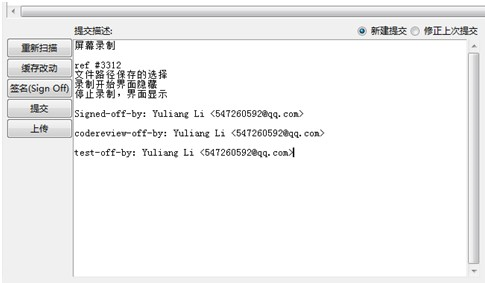

Git 使用文档
===============     

Git是一个分布式的版本控制系统。安装方法建议到官网。  

可供学习的网址 `git`_  &&   `git pro`_  

Git作为版本控制工具，每次提交的代码应该与QA系统中提交的工作报告相一致。  

Git使用中要注意的地方：*每次完成工作故事点的时候，需要将代码提交到QA版本库中。*  

特别注意 ``提交描述`` ，描述要详细说明提交代码的功能，让项目组中其他开发人员能够看得懂，你提交（更新）的代码作用或内容。  

 *提交格式：*   

::  

    Subject ：故事名称  

    ref #项目名称编号   

    Signed-off-by:签名   (可用快捷键ctrl+s或者直接点击‘签名’)     
  
    Codereview-off-by:代码审核者  

    Test-off-by:测试者    
  

::  

    Fix#项目编号 例: Fix  #3160 (代表3160工作已解决，在QA进度中会显示已解决)   

    Ref#项目编号 例: Ref  #3160(代表3160工作进行中，在QA进度中会显示进行中)  

.. _git: http://rogerdudler.github.io/git-guide/index.zh.html   
.. _git pro: http://iissnan.com/progit/
